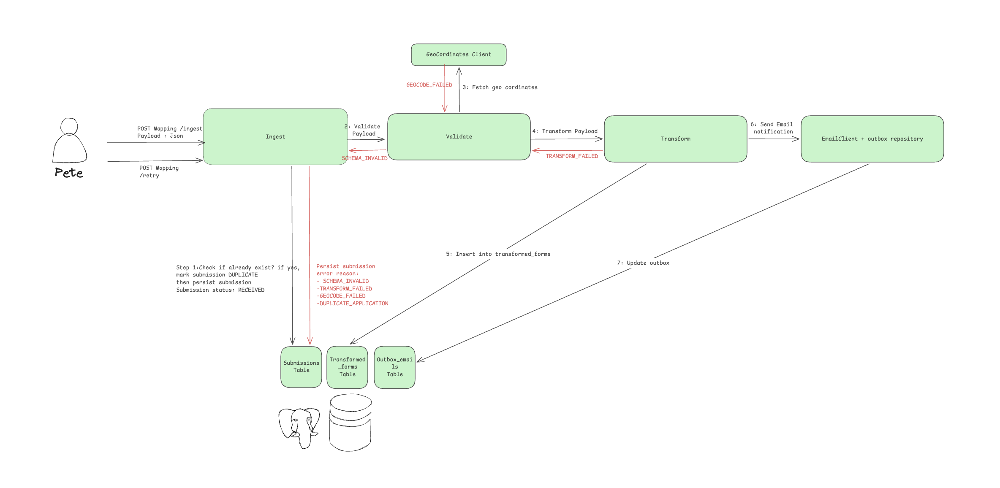
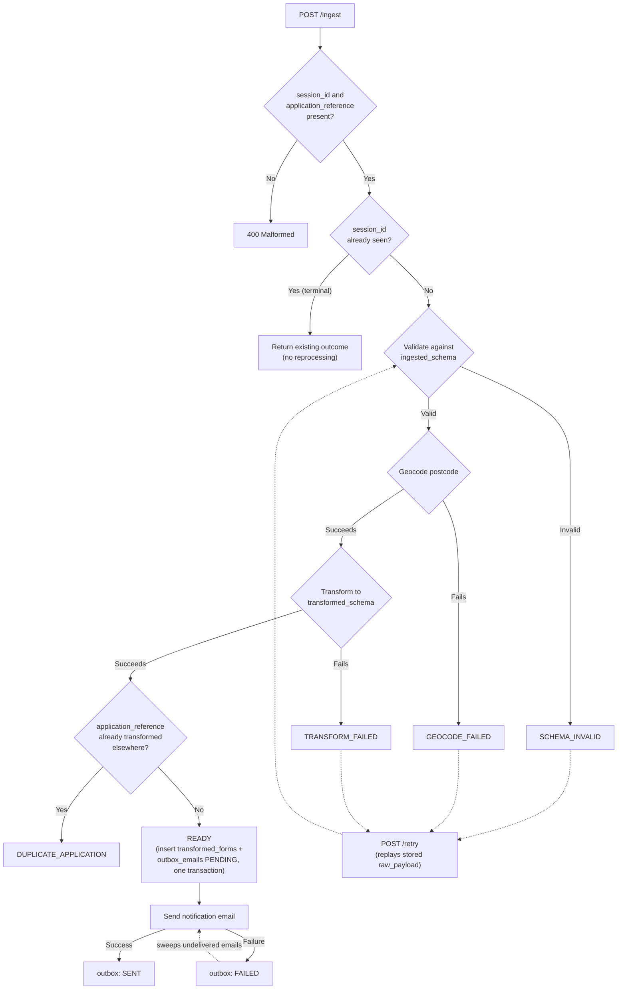

# take-home-test

At Healthtech-1, one of our core responsibilities is to ingest registration forms, transform them, update some external systems and get them ready for future processing (by the FORM-BOT).
We are sent these forms by a particularly unreliable 3rd party - we should expect them to make schema changes without informing us, send duplicate forms, or generally just be badly behaved!
As this is important healthcare data, we need to design our systems to be resilient to these kinds of errors.

Your task is to code a system for ingesting and processing these forms. For a form to become ready for our bots, it will need to:
- Be ingested into a database (via an `/ingest` endpoint). 
- Conform to the schema we've currently agreed with the external provider. This schema is found in `ingested_schema.ts` (but unfortunately the data source isn't 100% reliable and schema changes aren't always communicated in a timely fashion!)
- Have a longitude and latitude so that we have specific address information for the FORM-BOT. A mock implementation of a geocoding API (to transform the postcode into lat/long) is provided.
- Be transformed into the schema found in `transformed_schema.ts`.

In addition to this, if the transformation/another step is unsuccessful, we'd ideally like to be able to capture the error/data, ship a code change and then handle this form once that change has been deployed (e.g some kind of `/retry` endpoint)

Some additional notes on the system
- The third party external provider does not guarantee exactly once delivery
- We should never give the FORM-BOT the same form twice
- If the transform is successful, we should send a guaranteed email to our team happyforms@bots.com that a form was ingested

Some notes on this take home
- We expect you to add some basic tests to your code
- We expect you to use an actual database, as we'd like to see your schema design
- You can use AI to aid you in this task but please do not just ask Claude to do the whole thing for you
- You are free to pick another server technology (e.g. NestJS) if you wish and even pick another language though please check with us first on language.

## Local development

Stack: Java 21, Spring Boot, Gradle, Postgres (via Flyway migrations).

```
docker compose up -d      # start Postgres — required before bootRun AND test
./gradlew bootRun         # run the app (applies Flyway migrations on startup)
./gradlew test            # run tests (also connects to the docker-compose Postgres)
```

Migrations live in `src/main/resources/db/migration` (`V1__description.sql`, ...).

### Trying it out

With the app running:

```bash
# Happy path — a given example fixture
curl -X POST http://localhost:8080/ingest -H "Content-Type: application/json" \
  -d @src/test/resources/examples/person_one.json
# => {"status":"READY"}

# Schema drift — missing a required field
curl -X POST http://localhost:8080/ingest -H "Content-Type: application/json" -d '{
  "session_id": "demo-1", "application_reference": "GRU-DEMO-001",
  "name": "No Email", "gender": "male", "date_of_birth": "1990-01-01",
  "mobile_number": "07123456789",
  "address": {"address_line_1": "1 St", "address_line_2": "Town", "postcode": "AB1 2CD", "country": "UK"}
}'
# => 422 {"status":"SCHEMA_INVALID","error":"email is required"}

# Redelivering the same session_id doesn't reprocess or duplicate anything
curl -X POST http://localhost:8080/ingest -H "Content-Type: application/json" \
  -d @src/test/resources/examples/person_one.json
# => same {"status":"READY"} again

# Sweep everything still failing (after shipping a fix, if that's why it failed)
curl -X POST http://localhost:8080/retry -H "X-API-Key: dev-only-retry-key-change-me"
# => {"submissionsSucceeded":0,"submissionsFailed":1,"submissions":[...],"emailsRetried":0}
```

### Metrics dashboard (optional)

```
docker compose --profile observability up -d   # adds Prometheus (:9091) and Grafana (:3000)
```

Grafana is pre-provisioned — open http://localhost:3000 (anonymous viewer access, or admin/admin)
and the "Forms Ingestion Pipeline" dashboard is already there: submissions by status, emails by
status, submissions currently pending retry, and retry sweep duration (p95). Not started by plain
`docker compose up -d`, so the normal dev loop doesn't need these running.

## Design decisions

### High-level overview



### Detailed flow

Same shape, with the exact failure states and where `/retry` re-enters:



Dashed arrows are what `/retry` does: it doesn't invent a new path, it re-enters the exact same
pipeline for anything not yet `READY`/`DUPLICATE_APPLICATION`, and separately sweeps any
`outbox_emails` row that isn't `SENT`.

**Schema.** Three tables, separating untrusted input from derived output: `submissions` holds
whatever the 3rd party actually sent (`raw_payload JSONB`, tolerant of schema drift) plus a
status/retry tracker; `transformed_forms` and `outbox_emails` each carry a `UNIQUE` FK back to
`submissions`, so the database itself — not application logic — guarantees a submission is never
transformed or emailed twice.

**Dedup is two different problems.** `session_id UNIQUE` on `submissions` handles the 3rd party's
"doesn't guarantee exactly-once delivery" — a redelivered `session_id` short-circuits to the
existing outcome without reprocessing. Separately, `application_reference UNIQUE` on
`transformed_forms` handles a customer resubmitting under a *new* `session_id` — the DB rejects a
second transform for an application already handled elsewhere, and that submission is marked
`DUPLICATE_APPLICATION` (a valid outcome, not a failure).

**Retry replays the stored payload.** `/retry` re-runs the exact same validate → geocode →
transform → persist → outbox pipeline against each non-terminal submission's `raw_payload`. A
`SCHEMA_INVALID` submission correctly stays failed until the validation code actually changes; a
transient `GEOCODE_FAILED` can resolve on its own. Each submission (and each undelivered email) is
processed in its own try/catch, so one failure doesn't abort the rest of the sweep, and the
response reports each submission's outcome individually rather than just a count. Behind a shared
`X-API-Key` header, not a full auth framework — this is an internal ops action, not something the
3rd party calls, so it needs some guard but not that much ceremony.

**Guaranteed email uses the outbox pattern.** Marking a submission `READY` and recording that it
owes a notification email happen in one transaction, so a crash between "transform succeeded" and
"we noted an email is owed" can't lose the email. The actual send happens after that transaction
commits (never inside an open DB transaction) and gets an at-least-once guarantee, not
exactly-once — retrying a failed send can't be avoided without an idempotency key the mock email
provider doesn't support, so a rare duplicate internal notification is an accepted trade-off.

**Known limitations, disclosed rather than hidden:**
- Tests connect to the docker-compose Postgres directly rather than Testcontainers — on this
  development machine's Docker setup, ephemeral containers' dynamically-published ports weren't
  reliably reachable from the host.
- A missing `session_id`/`application_reference` is treated as a malformed request (400), not a
  processable-but-invalid submission — both columns are `NOT NULL`, so there's nowhere to persist
  one without the other.
- Metrics cover submission outcomes by status, email outcomes, current pending-retry count, and
  retry sweep duration — a real production system would likely add more (per-step latency,
  external dependency error rates) but this covers the questions "is anything stuck?" and "did
  the 3rd party's schema drift again?"

How to submit
- The email sent to you has a unique submission link, which will take you to a submission portal
- Please submit on the portal: a link to your repository and a link to a 5 minute (max) loom which explains your code and some of your design decisions
- If possible, please submit within 4-5 days of receiving the task
